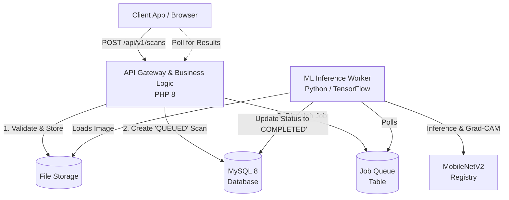

# DermScan AI - Clinical Dermatological Inference Platform

<div align="center">
  
  
  
  
  
</div>

---

DermScan AI is a production-grade, event-driven platform designed to provide automated, reliable, and explainable skin lesion inference. Built on a modular microservice architecture, it separates business logic from machine learning pipelines, ensuring high availability, strict clinical auditability, and deterministic model behavior.

## 🌟 Core Capabilities

* **Asynchronous Inference Pipeline**: Zero-data-loss job processing powered by a dedicated Python worker pool, eliminating synchronous HTTP bottlenecks.
* **Explainable AI (XAI)**: Native integration of Gradient-weighted Class Activation Mapping (Grad-CAM), generating attention heatmaps for clinical transparency.
* **Idempotent Operations**: Network-resilient API design utilizing `Idempotency-Key` headers to safely handle retries.
* **Model Lifecycle Management**: Strict ML model registry tying every diagnostic result to an immutable model hash (`v1.0.0` MobileNetV2 architecture).
* **Comprehensive Audit Trail**: Granular logging of system actions and diagnostic state transitions (`UPLOADED` → `QUEUED` → `PROCESSING` → `COMPLETED`).

## 🏗️ System Architecture

DermScan AI utilizes a decoupled architecture to isolate the Gateway (PHP) from the Inference Engine (Python).



## 🛠️ Technology Stack

| Component | Technology | Role |
|-----------|------------|------|
| **Gateway / UI** | PHP 8+, Twig, MDBootstrap | Identity, Session Management, Job Dispatch |
| **ML Worker** | Python 3.11, TensorFlow/Keras | Model Execution, Grad-CAM generation |
| **API Boundary** | FastAPI, Pydantic | System Health, Model Metadata, Gateway Abstraction |
| **Persistence** | MySQL 8 | Relational State, Job Queue, Audit Logs |

## 🚀 Deployment & Operations

### Prerequisites
* PHP 8.2+ with PDO extensions
* Python 3.11+
* MySQL 8.0+
* Composer & Pip

### 1. Database Initialization
Execute the schema to initialize the relational model, job queue, and model registry:
```bash
mysql -u root -p < database/schema.sql
```

### 2. Gateway Setup
Install dependencies and configure environments:
```bash
composer install
# Configure DB credentials and upload limits inside config/config.php and config/database.php
```

### 3. ML Service & Worker Initialization
Install ML dependencies:
```bash
cd ml_service
python -m venv venv
source venv/bin/activate  # On Windows: venv\Scripts\activate
pip install -r requirements.txt
```

Launch the FastAPI Abstraction Layer:
```bash
# Windows
start_ai_service.bat

# Linux/macOS
uvicorn api:app --host 0.0.0.0 --port 8000 --workers 4
```

Launch the Asynchronous Worker Daemon:
```bash
# Windows
start_worker.bat

# Linux/macOS
python worker.py
```

## 🔐 Security & Compliance

* **XAI Transparency**: AI decisions are paired with visual gradient maps to support human-in-the-loop validation.
* **Cryptographic Storage**: User passwords hashed via BCrypt (`PASSWORD_DEFAULT`).
* **Protection Mechanisms**: Built-in CSRF mitigation, PDO parameterized queries against SQLi, and Twig auto-escaping against XSS.
* **Deterministic Tracking**: Scans are permanently locked to their source ML model version via the `models` registry table.

---
*DermScan AI is built for professional engineering environments requiring scalable, explainable machine learning workflows.*
